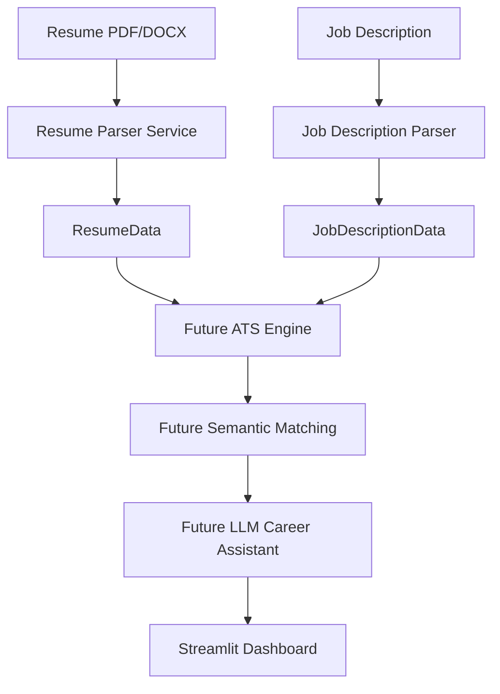
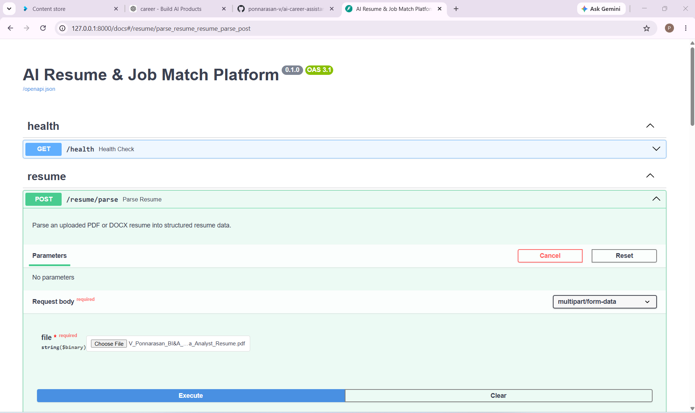
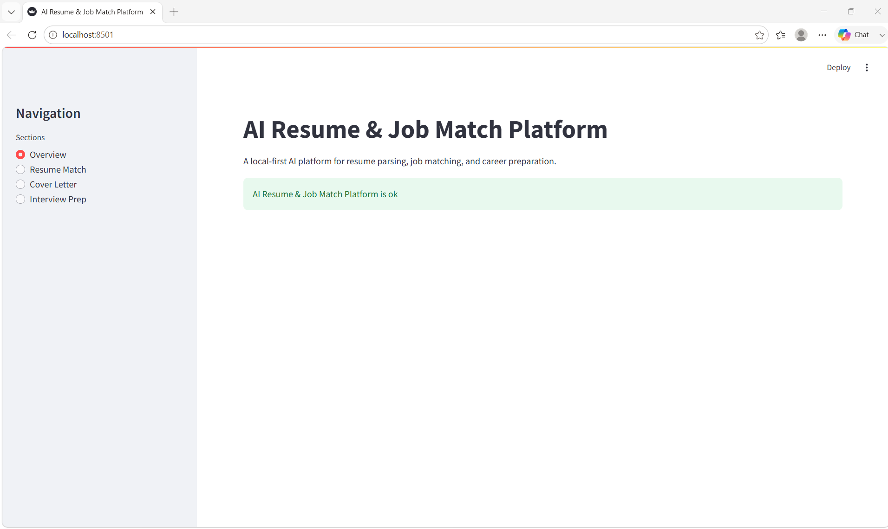

# 🚀 AI Career Assistant

<div align="center">


**A production-grade AI Career Assistant for resume parsing, job description parsing, and intelligent career assistance.**

*Built with clean architecture, FastAPI, Streamlit, comprehensive testing, and designed for future AI-powered ATS scoring and semantic job matching.*

</div>

---

# 📌 Overview

AI Career Assistant is a modular AI application that extracts structured information from resumes and job descriptions through REST APIs and a Streamlit interface.

The project is designed with production-style software architecture and serves as the foundation for future AI capabilities including:

- ATS Compatibility Scoring
- Semantic Job Matching
- Resume Optimization
- Cover Letter Generation
- Interview Preparation

Current release:

> **v0.1.0 — Resume & Job Description Parsing Backend**

---

# ✨ Current Features

## Resume Parsing

- ✅ PDF Resume Parsing
- ✅ DOCX Resume Parsing
- ✅ Contact Information Extraction
- ✅ Skills Extraction
- ✅ Education Extraction
- ✅ Projects Extraction
- ✅ Certifications Extraction
- ✅ Structured ResumeData Output

---

## Job Description Parsing

- ✅ Job Title Extraction
- ✅ Company Extraction
- ✅ Location Extraction
- ✅ Employment Type Extraction
- ✅ Required Skills
- ✅ Preferred Skills
- ✅ Responsibilities
- ✅ Education Requirements
- ✅ Experience Requirements
- ✅ Structured JobDescriptionData Output

---

## Backend

- ✅ FastAPI REST API
- ✅ Pydantic Models
- ✅ Modular Service Architecture
- ✅ Production-style Services
- ✅ File Validation
- ✅ Text Cleaning
- ✅ Comprehensive Error Handling

---

## Frontend

- ✅ Streamlit Dashboard
- ✅ Local-first Architecture

---

## Quality

- ✅ 43 Automated Tests
- ✅ Unit Tests
- ✅ Integration Tests

---

# 🏗 Architecture



---

# 📸 Screenshots

## Swagger API



---

## Streamlit Interface



---

# 🛠 Tech Stack

### Languages

- Python 3.12

### Backend

- FastAPI
- Pydantic

### Frontend

- Streamlit

### Document Processing

- PyMuPDF
- python-docx

### Testing

- pytest

### Development

- Git
- GitHub

---

## 📂 Project Structure

```text
ai-career-assistant/
│
├── app/
│   ├── api/
│   │   ├── main.py                 # FastAPI application
│   │   └── routes/
│   │       ├── health.py
│   │       └── resume.py
│   │
│   ├── core/
│   │   ├── config.py
│   │   └── logging.py
│   │
│   ├── models/
│   │   ├── resume.py
│   │   └── job_description.py
│   │
│   ├── services/
│   │   ├── document_service.py
│   │   ├── resume_information_extractor.py
│   │   ├── resume_parser_service.py
│   │   └── job_description_information_extractor.py
│   │
│   ├── ui/
│   │   ├── components/
│   │   ├── pages/
│   │   └── streamlit_app.py
│   │
│   └── utils/
│       ├── file_validation.py
│       └── text_cleaning.py
│
├── data/
│   ├── indexes/
│   ├── skill_taxonomy/
│   └── uploads/
│
├── docs/
│   └── images/
│
├── tests/
│   ├── fixtures/
│   ├── integration/
│   └── unit/
│
├── docker/
│
├── requirements.txt
├── requirements-dev.txt
└── README.md
```
---

# ⚙️ Installation

Clone the repository

```bash
git clone https://github.com/ponnarasan-v/ai-career-assistant.git

cd ai-career-assistant
```

Create a virtual environment

```bash
python -m venv .venv
```

Activate

### Windows

```bash
.venv\Scripts\activate
```

### Linux / macOS

```bash
source .venv/bin/activate
```

Install dependencies

```bash
pip install -r requirements.txt
```

---

# ▶️ Running the Project

## FastAPI

```bash
uvicorn app.api.main:app --reload
```

Open Swagger

```
http://127.0.0.1:8000/docs
```

---

## Streamlit

```bash
python -m streamlit run app/ui/streamlit_app.py
```

Open

```
http://localhost:8501
```

---

# 🌐 API Endpoints

| Method | Endpoint | Description |
|---------|----------|-------------|
| GET | `/health` | Health Check |
| POST | `/resume/parse` | Parse Resume |

> Additional endpoints will be added in future releases.

---

# ✅ Testing

Run the complete test suite

```bash
python -m pytest
```

Current Status

- ✅ 43 Passing Tests
- Unit Tests
- Integration Tests

---

# 🛣 Development Roadmap

## ✅ v0.1.0

- Resume Parser
- Job Description Parser
- FastAPI Backend
- Streamlit UI
- Resume Information Extraction
- Job Description Information Extraction
- Unit Tests
- Integration Tests

---

## 🚧 v0.2.0

- ATS Keyword Matching
- Missing Skills Detection
- ATS Compatibility Score
- Resume Recommendations

---

## 🚧 v0.3.0

- Semantic Job Matching
- Sentence Transformers
- Embedding-based Similarity
- Intelligent Ranking

---

## 🚧 v0.4.0

- Ollama Integration
- Resume Optimization
- Cover Letter Generator
- Interview Preparation
- AI Career Assistant

---

## 🚀 v1.0.0

- Docker Support
- CI/CD
- Cloud Deployment
- Production Monitoring
- Authentication
- Multi-user Support

---

# 🎯 Project Goals

This project demonstrates:

- Production-grade backend architecture
- REST API development using FastAPI
- Modern Python software engineering
- Modular AI application design
- Test-driven development practices
- Clean code and maintainable project structure

It is being developed as a portfolio project to showcase practical AI engineering skills for Machine Learning, AI, and Software Engineering roles.

---

# 🤝 Contributing

Contributions, suggestions, and issue reports are welcome.

Please open an issue before submitting large changes.

---

# 📄 License

This project is licensed under the MIT License.

---

<div align="center">

**⭐ If you find this project useful, consider giving it a star!**

Built with ❤️ using Python, FastAPI, and Streamlit.

</div># 🚀 AI Career Assistant

<div align="center">


**A production-grade AI Career Assistant for resume parsing, job description parsing, and intelligent career assistance.**

*Built with clean architecture, FastAPI, Streamlit, comprehensive testing, and designed for future AI-powered ATS scoring and semantic job matching.*

</div>

---

# 📌 Overview

AI Career Assistant is a modular AI application that extracts structured information from resumes and job descriptions through REST APIs and a Streamlit interface.

The project is designed with production-style software architecture and serves as the foundation for future AI capabilities including:

- ATS Compatibility Scoring
- Semantic Job Matching
- Resume Optimization
- Cover Letter Generation
- Interview Preparation

Current release:

> **v0.1.0 — Resume & Job Description Parsing Backend**

---

# ✨ Current Features

## Resume Parsing

- ✅ PDF Resume Parsing
- ✅ DOCX Resume Parsing
- ✅ Contact Information Extraction
- ✅ Skills Extraction
- ✅ Education Extraction
- ✅ Projects Extraction
- ✅ Certifications Extraction
- ✅ Structured ResumeData Output

---

## Job Description Parsing

- ✅ Job Title Extraction
- ✅ Company Extraction
- ✅ Location Extraction
- ✅ Employment Type Extraction
- ✅ Required Skills
- ✅ Preferred Skills
- ✅ Responsibilities
- ✅ Education Requirements
- ✅ Experience Requirements
- ✅ Structured JobDescriptionData Output

---

## Backend

- ✅ FastAPI REST API
- ✅ Pydantic Models
- ✅ Modular Service Architecture
- ✅ Production-style Services
- ✅ File Validation
- ✅ Text Cleaning
- ✅ Comprehensive Error Handling

---

## Frontend

- ✅ Streamlit Dashboard
- ✅ Local-first Architecture

---

## Quality

- ✅ 43 Automated Tests
- ✅ Unit Tests
- ✅ Integration Tests

---

# 🏗 Architecture


---

# 📸 Screenshots

## Swagger API


---

## Streamlit Interface


---

# 🛠 Tech Stack

### Languages

- Python 3.12

### Backend

- FastAPI
- Pydantic

### Frontend

- Streamlit

### Document Processing

- PyMuPDF
- python-docx

### Testing

- pytest

### Development

- Git
- GitHub

---

# 📂 Project Structure

```text
ai-career-assistant/

├── app/
│   ├── api/
│   │   ├── main.py
│   │   └── routes/
│   │
│   ├── core/
│   │
│   ├── models/
│   │   ├── resume.py
│   │   └── job_description.py
│   │
│   ├── services/
│   │   ├── document_service.py
│   │   ├── resume_information_extractor.py
│   │   ├── resume_parser_service.py
│   │   └── job_description_information_extractor.py
│   │
│   ├── ui/
│   │
│   └── utils/
│
├── tests/
│   ├── integration/
│   └── unit/
│
├── docs/
│   └── images/
│
├── requirements.txt
└── README.md
```

---

# ⚙️ Installation

Clone the repository

```bash
git clone https://github.com/ponnarasan-v/ai-career-assistant.git

cd ai-career-assistant
```

Create a virtual environment

```bash
python -m venv .venv
```

Activate

### Windows

```bash
.venv\Scripts\activate
```

### Linux / macOS

```bash
source .venv/bin/activate
```

Install dependencies

```bash
pip install -r requirements.txt
```

---

# ▶️ Running the Project

## FastAPI

```bash
uvicorn app.api.main:app --reload
```

Open Swagger

```
http://127.0.0.1:8000/docs
```

---

## Streamlit

```bash
python -m streamlit run app/ui/streamlit_app.py
```

Open

```
http://localhost:8501
```

---

# 🌐 API Endpoints

| Method | Endpoint | Description |
|---------|----------|-------------|
| GET | `/health` | Health Check |
| POST | `/resume/parse` | Parse Resume |

> Additional endpoints will be added in future releases.

---

# ✅ Testing

Run the complete test suite

```bash
python -m pytest
```

Current Status

- ✅ 43 Passing Tests
- Unit Tests
- Integration Tests

---

# 🛣 Development Roadmap

## ✅ v0.1.0

- Resume Parser
- Job Description Parser
- FastAPI Backend
- Streamlit UI
- Resume Information Extraction
- Job Description Information Extraction
- Unit Tests
- Integration Tests

---

## 🚧 v0.2.0

- ATS Keyword Matching
- Missing Skills Detection
- ATS Compatibility Score
- Resume Recommendations

---

## 🚧 v0.3.0

- Semantic Job Matching
- Sentence Transformers
- Embedding-based Similarity
- Intelligent Ranking

---

## 🚧 v0.4.0

- Ollama Integration
- Resume Optimization
- Cover Letter Generator
- Interview Preparation
- AI Career Assistant

---

## 🚀 v1.0.0

- Docker Support
- CI/CD
- Cloud Deployment
- Production Monitoring
- Authentication
- Multi-user Support

---

# 🎯 Project Goals

This project demonstrates:

- Production-grade backend architecture
- REST API development using FastAPI
- Modern Python software engineering
- Modular AI application design
- Test-driven development practices
- Clean code and maintainable project structure

It is being developed as a portfolio project to showcase practical AI engineering skills for Machine Learning, AI, and Software Engineering roles.

---

# 🤝 Contributing

Contributions, suggestions, and issue reports are welcome.

Please open an issue before submitting large changes.

---

# 📄 License

This project is licensed under the MIT License.

---

<div align="center">

**⭐ If you find this project useful, consider giving it a star!**

Built using Python, FastAPI, and Streamlit.

</div>